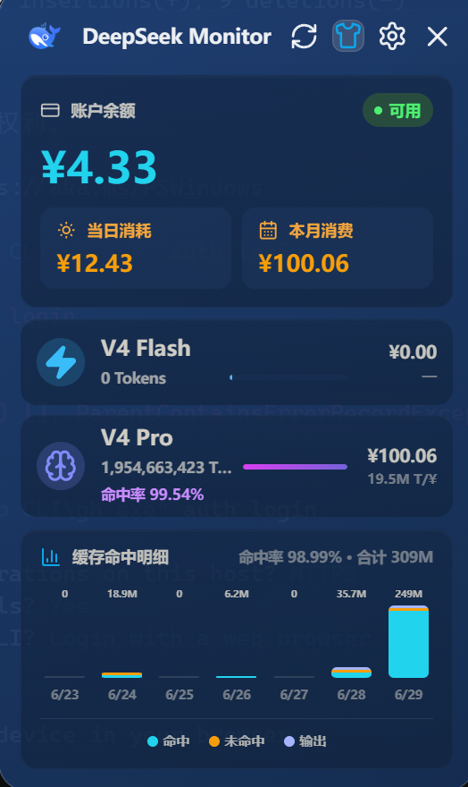
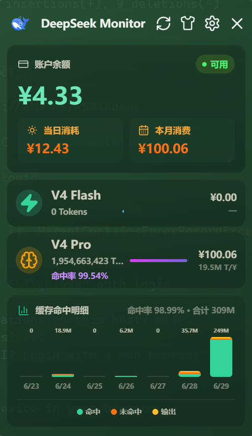
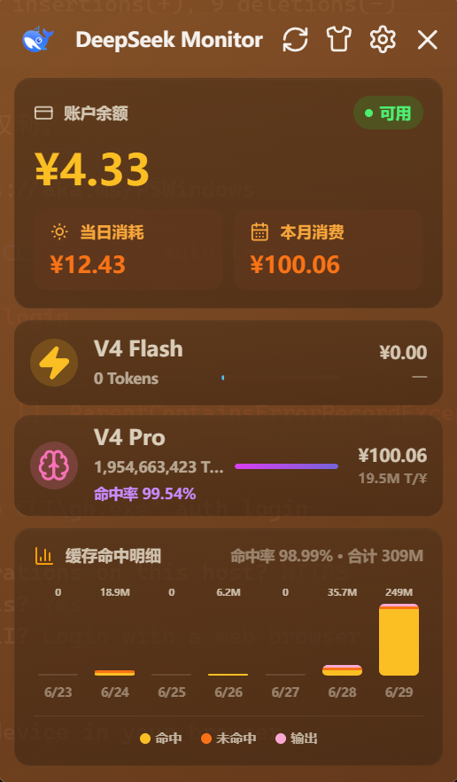
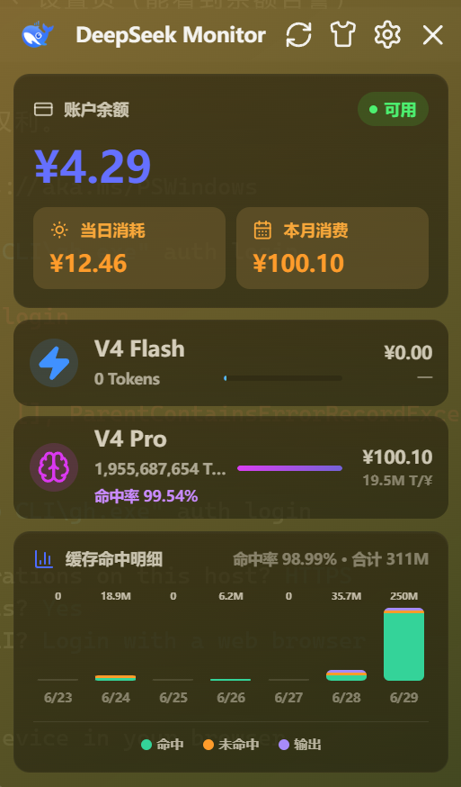

# DeepSeek Monitor Windows

DeepSeek Monitor Windows 是一个面向 Windows 的 DeepSeek API 用量监控桌面应用，用于查看账户余额、当月消费、模型 Token 用量和最近用量趋势。

> 本项目 fork 自 [Joyi-code/DeepSeekMonitorWindows](https://github.com/Joyi-code/DeepSeekMonitorWindows)，感谢原作者 [Joyi-code](https://github.com/Joyi-code) 的开源工作。
>
> 原项目又基于 [JayHome137/deepseek-monitor](https://github.com/JayHome137/DeepSeekMonitor) 的开源项目思路做 Windows 系统适配。

郑重声明：本项目不是 DeepSeek 官方产品。

## 页面截图

点击仪表盘 Shirt 按钮循环切换 7 套主题。

| | | | | | | | |
|-|-|-|-|-|-|-|-|
|  |  |  |  |  |  |  | *待补充* |

## 相较原项目的改动

### 7 主题切换

原项目仅暗色/亮色两套主题。本 fork 扩展为 7 套，点击 Shirt 按钮循环切换。每套主题独立设计了面板底色、卡片渐变、品牌强调色、Flash/Pro 模型色、图表分段色，所有视觉元素同步变化。

### 余额告警

设置页可配置余额告警线。账户余额低于阈值时，仪表盘余额卡片状态变为橙色「余额偏低」，并弹出告警提示条。7 套主题均有独立告警配色——暖金日落主题用红色与橙棕背景拉开对比，亮色系用深红文字保证可读性，暗色系用亮橙突出显示。

### 缓存命中率

命中率精确到小数点后两位，比原项目的四舍五入整数更精细。

## 功能

- 查询 DeepSeek API 账户余额，使用 DeepSeek 官方余额接口
- 查询 DeepSeek 平台用量数据，包括当月消费、模型 Token 总量、请求数、缓存命中、缓存未命中和输出 Token
- 支持 V4 Flash 与 V4 Pro 两类模型用量展示
- 缓存命中率精确到小数点后两位
- 支持最近 7 天消费趋势图和模型详情页
- **7 主题循环切换**（暗色 / 亮色 / 海洋蓝 / 森林绿 / 暖金日落 / 樱花粉 / 薰衣草紫）
- **余额告警**（可配置阈值，仪表盘实时提醒）
- 支持 Windows 托盘入口，主窗口默认不进入任务栏
- 支持 API Key 保存、清除和余额验证
- 支持用量 Token 自动同步和手动粘贴兜底

## 系统要求

- Windows 10 或 Windows 11
- Microsoft Edge WebView2 Runtime（Windows 11 通常已内置）

## 安装

从 [Releases](https://github.com/Muanyan-mjq/DeepSeekMonitor-Windows/releases) 下载最新 `.exe` 安装包运行即可。

## 本地开发

```powershell
git clone https://github.com/Muanyan-mjq/DeepSeekMonitor-Windows.git
cd DeepSeekMonitorWindows
npm install
npx tauri dev
```

需要 Node.js 18+、Rust 1.77.2+、Visual Studio Build Tools 2022（含 Desktop development with C++）。

## 构建安装包

```powershell
npm run build
```

产物位于 `src-tauri/target/release/bundle/nsis/`。

## 技术栈

Tauri 2 + React 18 + TypeScript + Rust

## 许可证

MIT License
