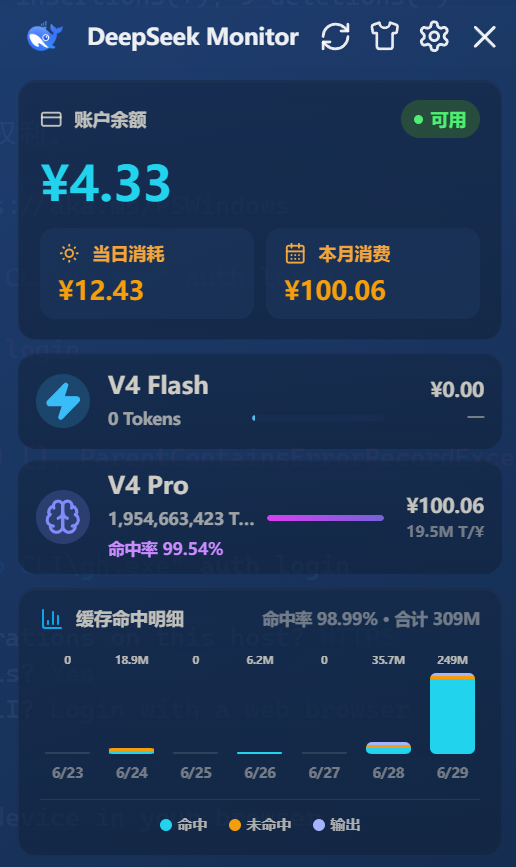

# DeepSeek Monitor Windows

Windows 桌面端 DeepSeek API 用量监控工具。实时查看账户余额、当月消费、模型 Token 用量和最近 7 天用量趋势，系统托盘常驻。

> Fork 自 [Joyi-code/DeepSeekMonitorWindows](https://github.com/Joyi-code/DeepSeekMonitorWindows)（v1.1.0），在此基础上做了功能增强。

## 预览

### 仪表盘


### 主题切换

| 暗色 | 亮色 | 海洋蓝 | 森林绿 | 暖金日落 | 樱花粉 | 薰衣草紫 |
|------|------|--------|--------|----------|--------|----------|
|  |  |  |  |  |  | 待补充 |

点击仪表盘 Shirt 按钮循环切换 7 套主题。

### 设置页



## 相较原项目的改动

### 7 主题切换

原项目只有暗色/亮色两套。本 fork 扩展到 7 套完整主题，点击 Shirt 按钮循环切换：

- 暗色系：暗色默认、海洋蓝、森林绿、暖金日落
- 亮色系：亮色、樱花粉、薰衣草紫

每套主题独立设计了面板底色、卡片渐变、品牌强调色、Flash/Pro 模型色、图表分段色，切换时所有元素同步变化。

### 余额告警

新增余额告警功能，在设置页配置告警线后生效：

- 账户余额低于设定值时，仪表盘余额卡片状态变为**橙色「余额偏低」**
- 弹出告警提示条，显示当前余额与告警线对比
- 7 套主题各有独立告警配色——暖金日落主题用红色告警避免与橙棕背景融合，亮色系用深红文字确保可读，暗色系用亮橙

### 缓存命中率精确显示

原项目命中率四舍五入到整数，本 fork 精确到**小数点后两位**（如 99.87%），更精细。

## 功能

- 查询 DeepSeek API 账户余额（官方接口）
- 当月消费、V4 Flash / V4 Pro Token 用量、请求数
- 缓存命中率精确显示
- 最近 7 天消费趋势堆叠柱状图（命中/未命中/输出明细悬停查看）
- 7 主题循环切换
- 余额告警（可配置阈值）
- 系统托盘常驻，不占任务栏
- 自动刷新（1 分钟 ~ 1 小时可调）
- API Key 本地存储，不上传

## 本地运行

```bash
npm install
npx tauri dev
```

需要 Node.js 18+、Rust 1.77.2+、Visual Studio Build Tools 2022（含 Desktop development with C++）。

## 构建安装包

```bash
npm run build
```

产物位于 `src-tauri/target/release/bundle/nsis/`，生成 `.exe` 安装程序。也可从 [Releases](https://github.com/Muanyan-mjq/DeepSeekMonitor-Windows/releases) 下载预构建版本。

## 技术栈

Tauri 2 + React 18 + TypeScript + Rust

## 许可证

MIT License
